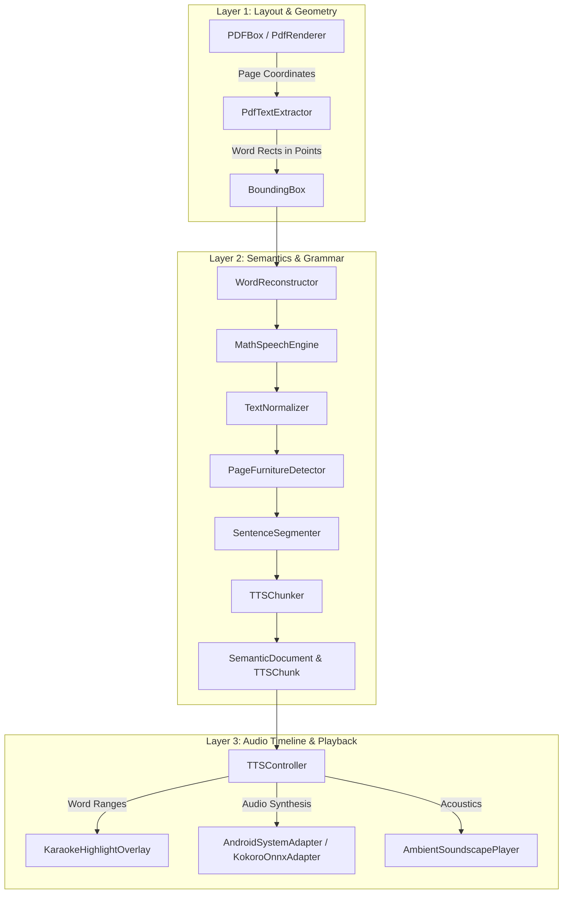

# Vachanam Android Technical Architecture & Core Logic

This document details the technical architecture, coordinate math, parser engines, audio synchronization, and technical audit history for **Vachanam for Android** (`VachanamAndroid/`).

---

## 1. 3-Layer Semantic Architecture (Kotlin)



### Layer 1: Layout Coordinate Normalization
- `BoundingBox` stores normalized coordinates $[0.0, 1.0]$ relative to the document page bounds:
  $$x_{\text{norm}} = \frac{x}{\text{width}}, \quad y_{\text{norm}} = \frac{y}{\text{height}}$$
- In Jetpack Compose (`PdfPageView.kt`), coordinates are scaled to canvas viewport dimensions:
  $$x_{\text{canvas}} = x_{\text{norm}} \times \text{canvasWidth}, \quad y_{\text{canvas}} = y_{\text{norm}} \times \text{canvasHeight}$$
- **Hit-Testing**: Tapping any point $(x, y)$ performs an $O(\log N)$ or spatial lookup across `SemanticWord` bounding boxes to immediately relocate playback.

### Layer 2: Semantic Models & Text Engines
- **`WordReconstructor.kt`**: Unifies hyphenated words split across line breaks (`probabil-` + `ity` $\to$ `probability`) while preserving true hyphenated compound words (`well-known`).
- **`MathSpeechEngine.kt`**: Precompiled regular expression replacement for exponents ($10^{23}$, $x^2$), scientific notation (`6.022e23`), SI units (`5 nm`, `2.4 GHz`), and LaTeX formulas (`\frac{a}{b}`, `\sqrt{x}`).
- **`TextNormalizer.kt`**: Expands Latin/scholarly abbreviations (`e.g.`, `i.e.`, `et al.`, `vs.`, `Fig.`, `pp.`) and formats URLs/DOIs.
- **`PageFurnitureDetector.kt`**: Identifies running headers, footers, page numbers, and copyright blocks to strip them from the TTS queue.
- **`SentenceSegmenter.kt`**: Uses Java's `BreakIterator.getSentenceInstance()` for precise sentence boundary detection.
- **`TTSChunker.kt`**: Partitions sentences into 10–25 word chunks for optimal synthesis cadence.

### Layer 3: Audio Timeline & Highlighting
- **Word-Level Karaoke Sync**: `AndroidSystemAdapter` registers an `UtteranceProgressListener`. On API 26+, `onRangeStart(utteranceId, start, end, frame)` emits character ranges for each spoken word, which are converted to monotonic `globalWordID` highlights in real time.
- **`PlaybackCoordinator.kt`**: Manages the authoritative `PlaybackCursor`, ensuring audio and visual highlight states remain strictly aligned without drift.

---

## 2. Universal Document Parsers

1. **PDF (`PdfTextExtractor.kt` & `PdfDocumentWrapper.kt`)**:
   - Uses PDFBox-Android to extract glyph positions and construct word bounding boxes.
   - Uses `android.graphics.pdf.PdfRenderer` with a $2\times$ scale matrix to produce crisp high-DPI page bitmaps.
2. **EPUB (`EPUBParser.kt`)**:
   - Decompresses `.epub` archives using streaming `ZipInputStream`.
   - Parses the OPF package document to extract manifest items and spine reading order.
   - Cleans HTML entities and inserts newlines before block tags to prevent word-gluing.
3. **Markdown (`MarkdownParser.kt`)**:
   - Extracts ATX (`#`) and Setext (`===`, `---`) headings, lists, quotes, and code blocks into structured `SemanticBlock` hierarchies.
4. **Plain Text (`PlainTextParser.kt`)**:
   - Cascading charset decoder: `UTF-8` $\to$ `ISO-8859-1` $\to$ `Windows-1252` $\to$ `UTF-16` $\to$ `ASCII`.
5. **Web Articles (`WebArticleParser.kt`)**:
   - HTTP GET fetcher with boilerpipe-style paragraph extraction and HTML entity decoding.

---

## 3. UI Virtual Pagination & Memory Management

- **Virtual Paging (`ReaderTextView.kt`)**: Large documents (e.g. 500-page books with 10,000+ paragraphs) are partitioned into sentence-aligned virtual pages (`SemanticDocumentBuilder.kt`).
- **`LazyColumn` Windowing**: Only sentences for the active virtual page are instantiated in the Compose view tree, maintaining a constant memory footprint and 120 FPS scrolling regardless of total book length.
- **Page Flipping**: `ReaderTextView` listens to the active `PlaybackCursor`. When speech advances past the last sentence of the current page, it automatically flips to the next virtual page.

---

## 4. Technical Audit History

1. **[AUD-17] Android Platform Port (Kotlin + Jetpack Compose)**:
   - Built full native Android application in `VachanamAndroid/` targeting API 31+ with Jetpack Compose Material 3.
   - Ported 3-layer semantic document architecture and coordinate math.
   - Implemented universal document parsers in Kotlin (EPUB, PDF, Markdown, Plain Text, Web Articles).
   - Built pluggable `TTSModelProtocol` with `AndroidSystemAdapter` and `KokoroOnnxAdapter`.
   - Integrated `AmbientSoundscapePlayer` with 5 bundled `.m4a` focus soundscape loops (`res/raw/`).
   - Added unit test suite `VachanamCoreLogicTest.kt` verifying word reconstruction, math speech vocalization, and chunk duration bounds.

---

## 5. Build & Test Commands

```bash
cd VachanamAndroid

# Run Unit Tests
./gradlew testDebugUnitTest

# Assemble Debug APK
./gradlew assembleDebug
```
