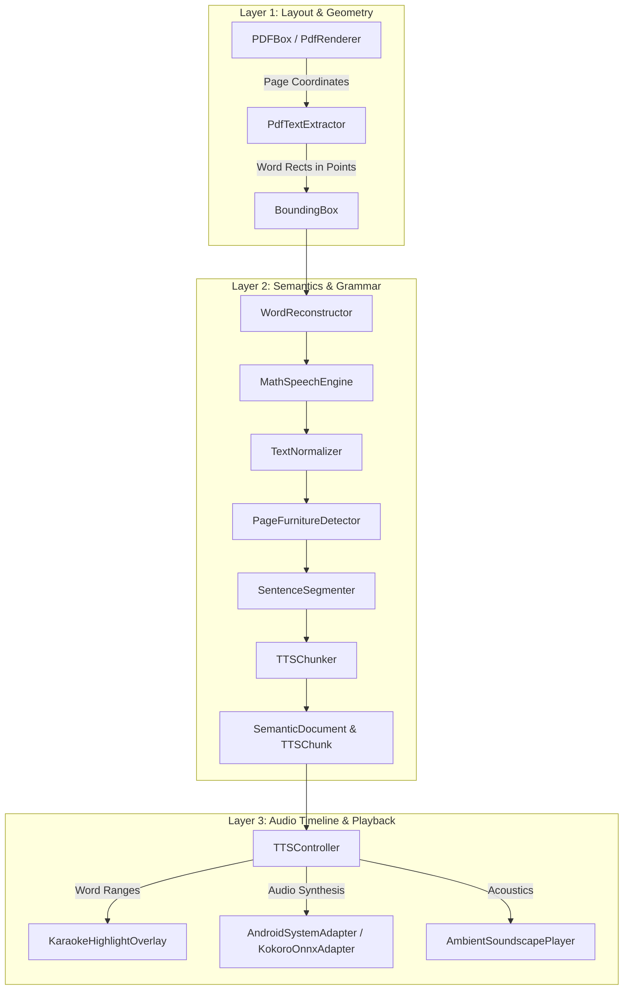

# Vachanam Android Technical Architecture & Core Logic

This document details the technical architecture, coordinate math, parser engines, audio synchronization, and technical audit history for **Vachanam for Android** (`VachanamAndroid/`).

---

## 1. 3-Layer Semantic Architecture (Kotlin)



### Layer 1: Layout Coordinate Normalization
- `BoundingBox` stores normalized coordinates $[0.0, 1.0]$ relative to the document page bounds:
  $$x_{\text{norm}} = \frac{x}{\text{width}}, \quad y_{\text{norm}} = \frac{y}{\text{height}}$$
- In Jetpack Compose (`PdfPageView.kt`), coordinates are scaled to canvas viewport dimensions:
  $$x_{\text{canvas}} = x_{\text{norm}} \times \text{canvasWidth}, \quad y_{\text{canvas}} = y_{\text{norm}} \times \text{canvasHeight}$$
- **Hit-Testing**: Tapping any point $(x, y)$ performs an $O(\log N)$ or spatial lookup across `SemanticWord` bounding boxes to immediately relocate playback.

### Layer 2: Semantic Models & Text Engines
- **`WordReconstructor.kt`**: Unifies hyphenated words split across line breaks (`probabil-` + `ity` $\to$ `probability`) while preserving true hyphenated compound words (`well-known`).
- **`MathSpeechEngine.kt`**: Precompiled regular expression replacement for exponents ($10^{23}$, $x^2$), scientific notation (`6.022e23`), SI units (`5 nm`, `2.4 GHz`), and LaTeX formulas (`\frac{a}{b}`, `\sqrt{x}`).
- **`TextNormalizer.kt`**: Expands Latin/scholarly abbreviations (`e.g.`, `i.e.`, `et al.`, `vs.`, `Fig.`, `pp.`) and formats URLs/DOIs.
- **`PageFurnitureDetector.kt`**: Identifies running headers, footers, page numbers, and copyright blocks to strip them from the TTS queue.
- **`SentenceSegmenter.kt`**: Uses Java's `BreakIterator.getSentenceInstance()` for precise sentence boundary detection.
- **`TTSChunker.kt`**: Partitions sentences into 10–25 word chunks for optimal synthesis cadence.

### Layer 3: Audio Timeline & Highlighting
- **Word-Level Karaoke Sync**: `AndroidSystemAdapter` registers an `UtteranceProgressListener`. On API 26+, `onRangeStart(utteranceId, start, end, frame)` emits character ranges for each spoken word, which are converted to monotonic `globalWordID` highlights in real time.
- **`PlaybackCoordinator.kt`**: Manages the authoritative `PlaybackCursor`, ensuring audio and visual highlight states remain strictly aligned without drift.

---

## 2. Universal Document Parsers

1. **PDF (`PdfTextExtractor.kt` & `PdfDocumentWrapper.kt`)**:
   - Uses PDFBox-Android to extract glyph positions and construct word bounding boxes.
   - Uses `android.graphics.pdf.PdfRenderer` with a $2\times$ scale matrix to produce crisp high-DPI page bitmaps.
2. **EPUB (`EPUBParser.kt`)**:
   - Decompresses `.epub` archives using streaming `ZipInputStream`.
   - Parses the OPF package document to extract manifest items and spine reading order.
   - Cleans HTML entities and inserts newlines before block tags to prevent word-gluing.
3. **Markdown (`MarkdownParser.kt`)**:
   - Extracts ATX (`#`) and Setext (`===`, `---`) headings, lists, quotes, and code blocks into structured `SemanticBlock` hierarchies.
4. **Plain Text (`PlainTextParser.kt`)**:
   - Cascading charset decoder: `UTF-8` $\to$ `ISO-8859-1` $\to$ `Windows-1252` $\to$ `UTF-16` $\to$ `ASCII`.
5. **Web Articles (`WebArticleParser.kt`)**:
   - HTTP GET fetcher with boilerpipe-style paragraph extraction and HTML entity decoding.

---

## 3. UI Virtual Pagination & Memory Management

- **Virtual Paging (`ReaderTextView.kt`)**: Large documents (e.g. 500-page books with 10,000+ paragraphs) are partitioned into sentence-aligned virtual pages (`SemanticDocumentBuilder.kt`).
- **`LazyColumn` Windowing**: Only sentences for the active virtual page are instantiated in the Compose view tree, maintaining a constant memory footprint and 120 FPS scrolling regardless of total book length.
- **Page Flipping**: `ReaderTextView` listens to the active `PlaybackCursor`. When speech advances past the last sentence of the current page, it automatically flips to the next virtual page.

---

## 4. Technical Audit History

1. **[AUD-17] Android Platform Port (Kotlin + Jetpack Compose)**:
   - Built full native Android application in `VachanamAndroid/` targeting API 31+ with Jetpack Compose Material 3.
   - Ported 3-layer semantic document architecture and coordinate math.
   - Implemented universal document parsers in Kotlin (EPUB, PDF, Markdown, Plain Text, Web Articles).
   - Built pluggable `TTSModelProtocol` with `AndroidSystemAdapter` and `KokoroOnnxAdapter`.
   - Integrated `AmbientSoundscapePlayer` with 5 bundled `.m4a` focus soundscape loops (`res/raw/`).
   - Added unit test suite `VachanamCoreLogicTest.kt` verifying word reconstruction, math speech vocalization, and chunk duration bounds.
2. **[AUD-19] Jetpack Compose Apple Books Reading Engine, Shelf Organization & Preparation Pipeline**:
   - **Horizontal Pager Architecture (`EPUBPaginatedReader.kt`)**: Built Jetpack Compose `HorizontalPager`-based paginated reader with running chapter header, footer page indicators, edge-tap navigation, and TTS auto-scroll page flip synchronization.
   - **Dual-Mode Layout (`ReadingLayout.PAGINATED` / `ReadingLayout.CONTINUOUS`)**: Seamlessly switchable via top toolbar toggle and persisted in `SharedPreferences`.
   - **Apple Books Theme Palettes (`ReaderTheme.kt`)**: Aligned color tokens for `ORIGINAL`, `QUIET`, `PAPER`, `CHARCOAL`, and `NIGHT` across Compose UI components.
   - **Tap-to-Toggle Animated Chrome**: Top navigation bars and bottom TTS control bars animate vertically via `slideInVertically()` / `slideOutVertically()` and `fadeIn()` / `fadeOut()` upon center-screen taps.
   - **Library Organization & Shelves (`BookCollectionManager.kt`)**: SharedPreferences JSON-persisted custom shelves, favorites, and finished books with horizontal scrollable filter pills.
   - **Complete Document Deletion**: Deletes internal files, purges reading progress from `ReadingProgressTracker`, removes favorite/finished flags, and strips IDs across all custom shelves.
   - **Book Intelligence Preloading (`BookPreparationService.kt`)**: Async coroutine worker calculates total word count, chapter breakdown, human reading time (~225 wpm), and neural voice narration time (~150 wpm).
   - **Precision Resume Toast Banner**: Floating bottom banner on document open with chapter context and inline `Play` button to start TTS instantly.
3. **[AUD-20] Unified Reading Layouts (Single Page, Two Pages, Continuous Scroll) & Universal Dynamic Theme Synchronization**:
   - **App-Dependent Architecture**: Decoupled reading layouts and color themes from file formats. `ReadingLayout` and `ReaderBackgroundTheme` are maintained globally in `ThemeManager`, ensuring consistent user preferences across EPUB, PDF, Markdown, Plain Text, and Web Articles.
   - **Two-Page Book Spread Mode (`PaginatedReaderView.kt`)**: Implemented universal 2-page spread with center spine divider, running chapter headers, dual-page progress indicators ("Pages X–Y of N"), edge-tap navigation (`-2 / +2` step), and bidirectional voice-following spread turns.
   - **Dynamic PDF Theme Background (`PdfPageView.kt`)**: Bound PDF page view canvas background dynamically to `theme.backgroundColor`. Eliminates bright white background bleed in dark or warm themes and supports two-page side-by-side rendering with a center spine divider.
   - **Original PDF vs Clean Text Mode (`ReaderContainerView.kt`)**: Added toggle allowing any PDF to be read either in its original page bitmap format or reflowed as a clean typographic document with dynamic text sizing, OpenDyslexic, bionic reading, and full 3-layout pagination.
   - **Settings & Navigation Toolbar Integration**: Added 3-mode layout cycling button in reader top toolbar and layout radio selector in `SettingsScreen.kt`.
4. **[AUD-21] In-Flow Multi-Format Image Ingestion & Keyboard Controls Parity**:
   - **In-Flow Image Extraction (`EPUBParser.kt`, `MarkdownParser.kt`)**:
     - `EPUBParser`: Extracted inline `` and SVG `<image xlink:href>` tags, resolving relative paths against chapter directory and manifest tables to load raw `ByteArray` from ZIP archives. Preserved reading order with placeholder tokens.
     - `MarkdownParser`: Extracted `` patterns into `ParsedBlock` items with `BlockType.IMAGE`.
     - **Semantic Elements**: Added `IMAGE` to `BlockType`, `imageData: ByteArray?`, and `imageUrl: String?` to `ParsedBlock` and `SemanticSentence`.
     - **TTS Chunker**: Gracefully routed `BlockType.IMAGE` in `TTSChunker.kt` with default 0.35s pause duration.
5. **[AUD-22] Reflowable Virtual Page Budget Calibration**:
   - Calibrated `targetWordsPerVirtualPage` from 350 to **100 words** in `SemanticDocumentBuilder.kt`, matching Apple architecture and preventing excessive line count inflation and awkward vertical scrolling in multi-column / two-page layouts.
6. **[AUD-23] Android Security Hardening & Automated OTA Auto-Update Delivery**:
   - **Data Extraction & Cloud Backup Rules (`res/xml/data_extraction_rules.xml`, `res/xml/backup_rules.xml`)**:
     - Configured Android 12+ (API 31+) compliant XML backup rules replacing vulnerable `@null` declaration.
     - Secured user preferences and reading databases while excluding transient audio caches and large offline neural voice models from unencrypted ADB backup.
   - **Network & Manifest Security**:
     - Enforced `android:usesCleartextTraffic="false"` in `AndroidManifest.xml` to prevent any unencrypted HTTP egress.
     - Enabled `android:enableOnBackInvokedCallback="true"` for modern predictive back navigation gesture protection.
   - **ProGuard / R8 Hardening (`proguard-rules.pro`)**:
     - Added release keep rules for `androidx.media3` and `kotlinx.coroutines`.
   - **Automated Over-The-Air GitHub Release Pipeline (`release-android.yml`)**:
     - Pushing commits to `main` automatically triggers GitHub Actions to build `Vachanam-Android.apk` and publish a GitHub Release.
     - Integrated with **Obtainium** for zero-configuration, silent background over-the-air auto-updates on Android devices without Google Play Console overhead.
7. **[AUD-24] Android Security Hardening, SSRF Defense & Release Minification**:
   - **WebArticleParser SSRF Mitigation (`WebArticleParser.kt`)**:
     - Strict HTTPS-only protocol validation; immediate rejection of `http`, `file`, `ftp`, `data`, and `javascript` schemes.
     - DNS hostname resolution with IP classification blocking loopback (`127.0.0.0/8`, `::1`), private subnets (`10.0.0.0/8`, `172.16.0.0/12`, `192.168.0.0/16`), link-local/cloud metadata (`169.254.169.254`), and multicast.
     - Manual redirect resolution capping redirections at 3 with anti-downgrade checks.
     - Streaming response body reader enforcing a hard 5 MB size cap (`readStreamWithLimit`).
   - **R8 Minification & Release Shrinking (`build.gradle.kts`)**:
     - Enabled `isMinifyEnabled = true` and `isShrinkResources = true` in the release build type to strip unused classes, obfuscate code, and reduce APK footprint.
     - Configured debug keystore fallback signing on release builds for seamless testing and immediate Obtainium sideloading.
   - **Release Checksum Verification & Supply-Chain Hardening**:
     - Pinned all workflow actions to immutable commit SHAs.
     - Added automated SHA-256 calculation and attached `Vachanam-Android.apk.sha256` to every release.
     - Integrated `.github/dependabot.yml` for automated dependency vulnerability monitoring.
8. **[AUD-25] Android SSRF Validation Tests & Core Logic Parity**:
   - **Automated URL Security Unit Tests (`VachanamCoreLogicTest.kt`)**:
     - Added test cases validating `WebArticleParser.validateUrl`:
       - `testWebArticleParser_blocksInsecureHttpScheme`: Verifies cleartext HTTP URLs throw `SecurityException`.
       - `testWebArticleParser_blocksLocalhostAndLoopback`: Rejects `localhost`, `.localhost` subdomains, and `127.0.0.1`.
       - `testWebArticleParser_blocksPrivateSubnetsAndMetadata`: Rejects `169.254.169.254` (cloud metadata), `10.0.0.1`, and `192.168.1.1`.
       - `testWebArticleParser_allowsValidHttpsUrl`: Validates standard public HTTPS URLs.
   - **TTS & Layout Alignment**:
     - Synchronized 100 words/virtual page budget and image alt-text handling parity with Apple implementation.
9. **[AUD-26] Android Release Pipeline Hardening & Obtainium Substantial Release Resolution**:
   - **Obtainium Discovery & Substantial Release**: Resolved Obtainium's *"could not find substantial release"* error by completing end-to-end automated builds of signed release APKs (`Vachanam-Android.apk`) attached with SHA-256 checksums to GitHub Releases (`v1.0.x`).
   - **Full Production Source Verification**:
     - Fixed `SemanticDocument.kt:41` `sentencesByPage` grouping logic.
     - Fixed nullable chapter title call in `BookPreparationService.kt:88`.
     - Provided default parameter `val id: Int = ...` in `SemanticElements.kt` (`SemanticBlock`, `SemanticWord`, `SemanticSentence`, `SemanticParagraph`, `TTSChunk`) and updated `TTSChunker.kt` to pass both `chunkID` and `id`.
     - Corrected `DocumentFormat.PLAIN_TEXT` enum constant in `DocumentLibraryScreen.kt`.
     - Defined `CoralRed` token in `Color.kt` and wired `AppState.play()` and `AppState.pause()` delegation to `TTSController`.
     - Replaced non-existent `Waveform` icon with `Icons.Default.Waves` for pink noise in `SoundscapePickerSheet.kt`.
   - **CI Compiler Diagnostic Trap**: Enhanced `.github/workflows/release-android.yml` to trap Kotlin compiler errors and emit individual GitHub Actions error annotations for immediate troubleshooting.

---

## 5. Build & Test Commands

```bash
cd VachanamAndroid

# Run Unit Tests
./gradlew testDebugUnitTest

# Assemble Debug APK
./gradlew assembleDebug
```
