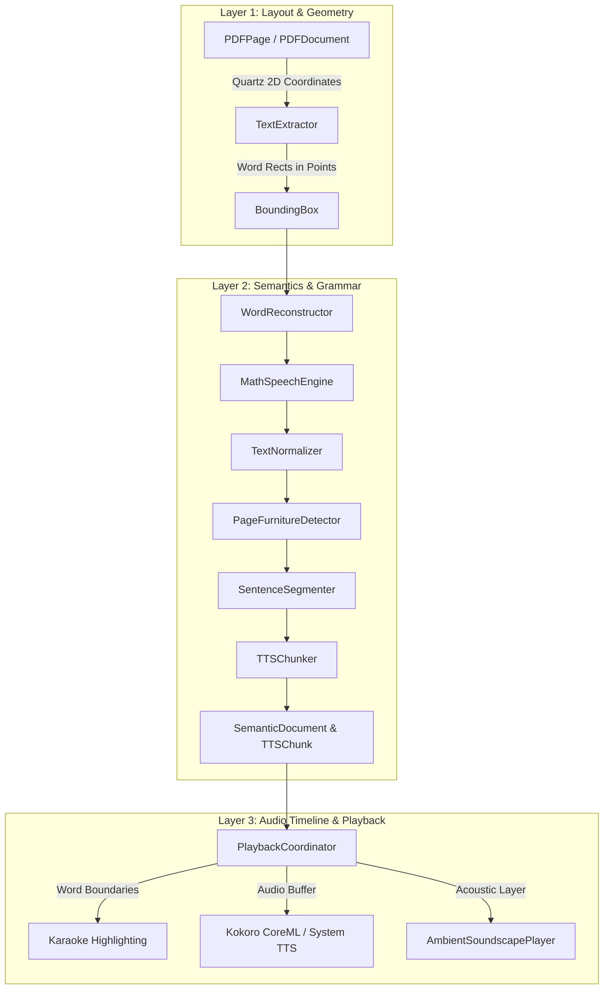

# Vachanam Apple Technical Architecture & Core Logic (iPadOS & macOS)

This document details the core logic, algorithms, coordinate systems, and technical audit history for **Vachanam for Apple** (`VachanamApple/`).

---

## 1. 3-Layer Document Architecture



### Layer 1: Layout Coordinate Normalization
- **PDF Coordinate System (Quartz 2D)**: Origin $(0, 0)$ is at the **bottom-left** corner of the page.
- **SwiftUI / UIKit Coordinate System**: Origin $(0, 0)$ is at the **top-left** corner of the view.
- **Transform**:
  $$\text{viewY} = \text{pageHeight} - (\text{pdfY} + \text{pdfHeight})$$
- `BoundingBox` stores normalized coordinates $[0.0, 1.0]$ relative to page dimensions:
  $$x_{\text{norm}} = \frac{x}{\text{width}}, \quad y_{\text{norm}} = \frac{y}{\text{height}}$$

### Layer 2: Semantic Text & Speech Processing
1. **Word Reconstruction (`WordReconstructor.swift`)**:
   - Joins hyphenated words broken across line breaks (`probabil-` + `ity` $\to$ `probability`).
   - Preserves compound words (`state-of-the-art`, `well-known`).
2. **Mathematical Speech Engine (`MathSpeechEngine.swift`)**:
   - Exponents: Translates $10^{23}$ into *"10 to the power of 23"*, $x^2$ into *"x squared"*.
   - Scientific Notation: Translates `6.022e23` into *"6.022 times 10 to the power of 23"*.
   - SI Units: Expands `5 nm` $\to$ *"5 nanometers"*, `2.4 GHz` $\to$ *"2.4 gigahertz"*.
   - LaTeX: Translates `\frac{a}{b}` $\to$ *"a over b"*, `\sqrt{x}` $\to$ *"square root of x"*.
3. **Academic Furniture Isolation (`PageFurnitureDetector.swift`)**:
   - Filters out running headers, footers, page numbers, and copyright disclaimers so TTS flows continuously.
4. **Sentence & Chunk Segmentation (`SentenceSegmenter.swift` & `TTSChunker.swift`)**:
   - Uses `NLTokenizer` for accurate sentence boundary detection.
   - Groups sentences into 10–25 word `TTSChunk` items with tuned inter-sentence pauses.

### Layer 3: Audio Timeline & Synchronization
- **Authoritative Playback Cursor**: Managed by `PlaybackCoordinator.swift`.
- **Drift Compensation**: Audio timestamp telemetry keeps the visual highlight bounded to within $\pm 50\text{ ms}$ of the synthesized phoneme audio.
- **Audio Session**: Configured for `.playback` with `.duckOthers` or `.mixWithOthers` based on ambient soundscape toggle.

---

## 2. On-Device Speech Synthesis Pipeline

- **Kokoro 82M CoreML Engine**: Executes locally on the Apple Silicon Neural Engine (ANE) and GPU via CoreML and MLX (`Packages/kokoro-coreml/swift-tts`).
- **Phonemization**: Uses Misaki G2P for English phonetic transcription with custom pronunciation dictionary overrides (`PronunciationManager.swift`).
- **System Fallback**: Automatically cascades to `AVSpeechSynthesizer` when low battery or thermal throttling occurs.

---

## 3. Apple Pencil & PencilKit Integration (`iOS/`)

- `AnnotationManager.swift`: Manages PKDrawing serialization, stroke models, and undo/redo stacks.
- `CanvasOverlay.swift`: Non-blocking spatial canvas positioned directly over `PDFView` or `ReaderTextView`.
- `AnnotationExportView.swift`: Flattens vector annotations into exported PDF pages with Quartz 2D graphics context rendering.

---

## 4. Mac Catalyst & Audiobook Studio (`macOS/`)

- `AudiobookGenerator.swift`: Multi-worker batch queue synthesizing long documents into multi-track audiobook files (`.m4b` / `.m4a`).
- `AudiobookManifest.swift`: Emits chapter-by-chapter metadata, durations, and word boundary timestamps.
- `ReaderNavigationCommands.swift`: Registers native macOS menu bar shortcuts and handles system keyboard events.

---

## 5. Technical Audit History

1. **[AUD-01] AppState Lifecycle & Reading Progress Restoration**:
   - Fixed race conditions during backgrounding; persisted `readingProgress` using atomic file writes.
2. **[AUD-02] Hit-Testing & Viewport Stability**:
   - Corrected Quartz 2D to UIKit coordinate inversion in `WordHighlightOverlay`.
3. **[AUD-03] Word Reconstruction & Compound Words**:
   - Added hyphenation lookahead buffer in `WordReconstructor`.
4. **[AUD-04] Symbol-to-Speech Normalization**:
   - Added dictionary for Greek letters ($\alpha, \beta, \gamma$), operators, and symbols.
5. **[AUD-05] Exponent Speech Engine**:
   - Implemented regex rule set for nested superscripts and exponents.
6. **[AUD-06] Academic Page Furniture Isolation**:
   - Added spatial heuristic bounding checks for headers and footers.
7. **[AUD-07] Continuous & Spread Highlighting**:
   - Synchronized two-page spread bounding boxes.
8. **[AUD-08] Auto-Scroll Follow Mode**:
   - Smooth programmatic scrolling following the speaking sentence.
9. **[AUD-09] Keyboard Navigation Suite**:
   - Added full keyboard commands for macOS Catalyst and iPad Smart Keyboard.
10. **[AUD-10] Multi-Discipline Benchmark Document**:
    - Embedded 4-page cross-discipline PDF testing math, tables, footnotes, and code.
11. **[AUD-11] Ambient Focus Soundscapes**:
    - Integrated 5 seamless `.m4a` soundscape loops with independent volume.
12. **[AUD-12] Developer Diagnostics HUD**:
    - Added telemetry overlay for token processing latency, RTF, and buffer states.
13. **[AUD-13] Sentence Flow & Cadence Restoration**:
    - Rebalanced inter-chunk silence injection to restore natural breathing pauses.
14. **[AUD-14] Line-Pitch Clamping & Math Symbol Bleed Prevention**:
    - Prevented adjacent superscript bounding box overlap.
15. **[AUD-15] EPUB & Multi-Format Ingestion Robustness**:
    - Replaced unaligned memory reads with bitwise byte readers to prevent ARM64 SIGBUS crashes.
    - Added chunked streaming deflate for ZIP entry extraction.
16. **[AUD-16] EPUB Parser Acceleration & Reader Virtual Paging**:
    - Added $O(1)$ case-insensitive hash lookups in `ZipArchive`.
    - Virtualized `ReaderTextView` with `LazyVStack` pagination windowing.
17. **[AUD-18] Apple Platform Specialization & Self-Contained Project**:
    - Renamed and organized Apple code into `VachanamApple/` with dedicated `Shared/`, `iOS/`, `macOS/`, `Tests/`, and `UITests/`.
    - Made `generate_project.py` self-contained within `VachanamApple/`.
    - Maintained full target parity and clean build for both Mac Catalyst and iPadOS Simulator.
18. **[AUD-19] Apple Books Reading Experience, Shelf Organization & Book Intelligence**:
    - **Dual-Mode Reading Layout**: Implemented `.paginated` (Apple Books horizontal edge-tap pagination with chapter headers, page count footers, and Kokoro TTS auto-page flips) and `.continuous` (vertical smooth scroll) switchable via "Aa" Appearance menu and top navigation.
    - **Apple Books Theme Palettes**: Integrated `Original` (pure white / dark mode system adaptive), `Quiet` (warm eggshell), `Paper` (textured sepia), `Charcoal` (deep slate gray), and `Night` (true OLED black).
    - **Tap-to-Toggle Immersive Chrome**: Top navigation bars and bottom scrubber bars animate in/out on center tap; edge taps advance/rewind pages.
    - **Library Organization & Shelves (`BookCollectionManager.swift`)**: Built-in dynamic collections (`All`, `Reading`, `Favorites`, `Finished`) and user-created custom shelves with UserDefaults persistence.
    - **Document Deletion & Sandbox Sanitation**: Deletes the local document file, resets reading progress, removes favorite/finished flags, and strips the document ID across all shelves.
    - **Book Intelligence Preloading (`BookPreparationService.swift`)**: Background async parsing computes total word counts, chapter structures, human reading duration (~225 wpm), and neural TTS audio duration (~150 wpm) cached for instant inspection via `BookStructureSheet.swift`.
    - **Precision Resume Banner**: Displays an animated toast upon book open ("Resume at Page X: [Chapter Title]") with an inline `Play` button to immediately start neural narration.

---

## 6. Build, Test & Project Synchronization

```bash
cd VachanamApple

# Regenerate Xcode Project & Build Schemes
python3 generate_project.py

# Run Unit Tests on macOS (Mac Catalyst)
xcodebuild -project Vachanam.xcodeproj -scheme Vachanam -destination 'platform=macOS,variant=Mac Catalyst' -only-testing:VachanamTests -quiet test

# Run Unit Tests on iOS Simulator (iPad Air M4)
xcodebuild -project Vachanam.xcodeproj -scheme Vachanam -destination 'platform=iOS Simulator,name=iPad Air 11-inch (M4)' -only-testing:VachanamTests -quiet test
```
