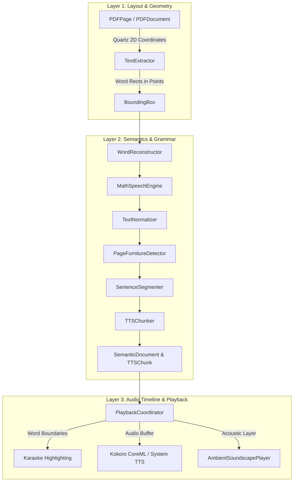

# Vachanam Apple Technical Architecture & Core Logic (iPadOS & macOS)

This document details the core logic, algorithms, coordinate systems, and technical audit history for **Vachanam for Apple** (`VachanamApple/`).

---

## 1. 3-Layer Document Architecture



### Layer 1: Layout Coordinate Normalization
- **PDF Coordinate System (Quartz 2D)**: Origin $(0, 0)$ is at the **bottom-left** corner of the page.
- **SwiftUI / UIKit Coordinate System**: Origin $(0, 0)$ is at the **top-left** corner of the view.
- **Transform**:
  $$\text{viewY} = \text{pageHeight} - (\text{pdfY} + \text{pdfHeight})$$
- `BoundingBox` stores normalized coordinates $[0.0, 1.0]$ relative to page dimensions:
  $$x_{\text{norm}} = \frac{x}{\text{width}}, \quad y_{\text{norm}} = \frac{y}{\text{height}}$$

### Layer 2: Semantic Text & Speech Processing
1. **Word Reconstruction (`WordReconstructor.swift`)**:
   - Joins hyphenated words broken across line breaks (`probabil-` + `ity` $\to$ `probability`).
   - Preserves compound words (`state-of-the-art`, `well-known`).
2. **Mathematical Speech Engine (`MathSpeechEngine.swift`)**:
   - Exponents: Translates $10^{23}$ into *"10 to the power of 23"*, $x^2$ into *"x squared"*.
   - Scientific Notation: Translates `6.022e23` into *"6.022 times 10 to the power of 23"*.
   - SI Units: Expands `5 nm` $\to$ *"5 nanometers"*, `2.4 GHz` $\to$ *"2.4 gigahertz"*.
   - LaTeX: Translates `\frac{a}{b}` $\to$ *"a over b"*, `\sqrt{x}` $\to$ *"square root of x"*.
3. **Academic Furniture Isolation (`PageFurnitureDetector.swift`)**:
   - Filters out running headers, footers, page numbers, and copyright disclaimers so TTS flows continuously.
4. **Sentence & Chunk Segmentation (`SentenceSegmenter.swift` & `TTSChunker.swift`)**:
   - Uses `NLTokenizer` for accurate sentence boundary detection.
   - Groups sentences into 10–25 word `TTSChunk` items with tuned inter-sentence pauses.

### Layer 3: Audio Timeline & Synchronization
- **Authoritative Playback Cursor**: Managed by `PlaybackCoordinator.swift`.
- **Drift Compensation**: Audio timestamp telemetry keeps the visual highlight bounded to within $\pm 50\text{ ms}$ of the synthesized phoneme audio.
- **Audio Session**: Configured for `.playback` with `.duckOthers` or `.mixWithOthers` based on ambient soundscape toggle.

---

## 2. On-Device Speech Synthesis Pipeline

- **Kokoro 82M CoreML Engine**: Executes locally on the Apple Silicon Neural Engine (ANE) and GPU via CoreML and MLX (`Packages/kokoro-coreml/swift-tts`).
- **Phonemization**: Uses Misaki G2P for English phonetic transcription with custom pronunciation dictionary overrides (`PronunciationManager.swift`).
- **System Fallback**: Automatically cascades to `AVSpeechSynthesizer` when low battery or thermal throttling occurs.

---

## 3. Apple Pencil & PencilKit Integration (`iOS/`)

- `AnnotationManager.swift`: Manages PKDrawing serialization, stroke models, and undo/redo stacks.
- `CanvasOverlay.swift`: Non-blocking spatial canvas positioned directly over `PDFView` or `ReaderTextView`.
- `AnnotationExportView.swift`: Flattens vector annotations into exported PDF pages with Quartz 2D graphics context rendering.

---

## 4. Mac Catalyst & Audiobook Studio (`macOS/`)

- `AudiobookGenerator.swift`: Multi-worker batch queue synthesizing long documents into multi-track audiobook files (`.m4b` / `.m4a`).
- `AudiobookManifest.swift`: Emits chapter-by-chapter metadata, durations, and word boundary timestamps.
- `ReaderNavigationCommands.swift`: Registers native macOS menu bar shortcuts and handles system keyboard events.

---

## 5. Technical Audit History

1. **[AUD-01] AppState Lifecycle & Reading Progress Restoration**:
   - Fixed race conditions during backgrounding; persisted `readingProgress` using atomic file writes.
2. **[AUD-02] Hit-Testing & Viewport Stability**:
   - Corrected Quartz 2D to UIKit coordinate inversion in `WordHighlightOverlay`.
3. **[AUD-03] Word Reconstruction & Compound Words**:
   - Added hyphenation lookahead buffer in `WordReconstructor`.
4. **[AUD-04] Symbol-to-Speech Normalization**:
   - Added dictionary for Greek letters ($\alpha, \beta, \gamma$), operators, and symbols.
5. **[AUD-05] Exponent Speech Engine**:
   - Implemented regex rule set for nested superscripts and exponents.
6. **[AUD-06] Academic Page Furniture Isolation**:
   - Added spatial heuristic bounding checks for headers and footers.
7. **[AUD-07] Continuous & Spread Highlighting**:
   - Synchronized two-page spread bounding boxes.
8. **[AUD-08] Auto-Scroll Follow Mode**:
   - Smooth programmatic scrolling following the speaking sentence.
9. **[AUD-09] Keyboard Navigation Suite**:
   - Added full keyboard commands for macOS Catalyst and iPad Smart Keyboard.
10. **[AUD-10] Multi-Discipline Benchmark Document**:
    - Embedded 4-page cross-discipline PDF testing math, tables, footnotes, and code.
11. **[AUD-11] Ambient Focus Soundscapes**:
    - Integrated 5 seamless `.m4a` soundscape loops with independent volume.
12. **[AUD-12] Developer Diagnostics HUD**:
    - Added telemetry overlay for token processing latency, RTF, and buffer states.
13. **[AUD-13] Sentence Flow & Cadence Restoration**:
    - Rebalanced inter-chunk silence injection to restore natural breathing pauses.
14. **[AUD-14] Line-Pitch Clamping & Math Symbol Bleed Prevention**:
    - Prevented adjacent superscript bounding box overlap.
15. **[AUD-15] EPUB & Multi-Format Ingestion Robustness**:
    - Replaced unaligned memory reads with bitwise byte readers to prevent ARM64 SIGBUS crashes.
    - Added chunked streaming deflate for ZIP entry extraction.
16. **[AUD-16] EPUB Parser Acceleration & Reader Virtual Paging**:
    - Added $O(1)$ case-insensitive hash lookups in `ZipArchive`.
    - Virtualized `ReaderTextView` with `LazyVStack` pagination windowing.
17. **[AUD-18] Apple Platform Specialization & Self-Contained Project**:
    - Renamed and organized Apple code into `VachanamApple/` with dedicated `Shared/`, `iOS/`, `macOS/`, `Tests/`, and `UITests/`.
    - Made `generate_project.py` self-contained within `VachanamApple/`.
    - Maintained full target parity and clean build for both Mac Catalyst and iPadOS Simulator.
18. **[AUD-19] Apple Books Reading Experience, Shelf Organization & Book Intelligence**:
    - **Dual-Mode Reading Layout**: Implemented `.paginated` (Apple Books horizontal edge-tap pagination with chapter headers, page count footers, and Kokoro TTS auto-page flips) and `.continuous` (vertical smooth scroll) switchable via "Aa" Appearance menu and top navigation.
    - **Apple Books Theme Palettes**: Integrated `Original` (pure white / dark mode system adaptive), `Quiet` (warm eggshell), `Paper` (textured sepia), `Charcoal` (deep slate gray), and `Night` (true OLED black).
    - **Tap-to-Toggle Immersive Chrome**: Top navigation bars and bottom scrubber bars animate in/out on center tap; edge taps advance/rewind pages.
    - **Library Organization & Shelves (`BookCollectionManager.swift`)**: Built-in dynamic collections (`All`, `Reading`, `Favorites`, `Finished`) and user-created custom shelves with UserDefaults persistence.
    - **Document Deletion & Sandbox Sanitation**: Deletes the local document file, resets reading progress, removes favorite/finished flags, and strips the document ID across all shelves.
    - **Book Intelligence Preloading (`BookPreparationService.swift`)**: Background async parsing computes total word counts, chapter structures, human reading duration (~225 wpm), and neural TTS audio duration (~150 wpm) cached for instant inspection via `BookStructureSheet.swift`.
    - **Precision Resume Banner**: Displays an animated toast upon book open ("Resume at Page X: [Chapter Title]") with an inline `Play` button to immediately start neural narration.
19. **[AUD-20] Unified Reading Layouts (Single Page, Two Pages, Continuous Scroll) & Universal Dynamic Theme Synchronization**:
    - **App-Dependent Architecture**: Decoupled reading layouts and color themes from file formats. `ReadingLayout` and `ReaderBackgroundTheme` are maintained globally in `ThemeManager`, ensuring consistent user preferences across EPUB, PDF, Markdown, Plain Text, and Web Articles.
    - **Two-Page Book Spread Mode (`PaginatedReaderView.swift`)**: Built universal 2-page spread with center spine divider, running chapter headers, dual-page progress indicators ("Pages X–Y of N"), edge-tap navigation (`-2 / +2` step), and bidirectional voice-following spread turns.
    - **Dynamic PDF Theme Background**: `PDFReaderView.swift` binds `pdfView.backgroundColor` directly to `themeManager.currentReaderTheme.backgroundColor` on initial load and inside `updateUIView`. Eliminates glaring white page borders in dark or warm themes.
    - **Native PDF Mode Toggle**: Enabled switching between fixed-layout PDF and clean text extraction mode directly from the reader navigation bar, granting PDFs access to dynamic font size, OpenDyslexic, bionic reading, and full 3-layout pagination.
    - **Scrubber & Controls Parity**: Updated `ReaderScrubberBar.swift` to format spread ranges ("Pages X–Y of N"), and exposed universal `ReadingLayout` picker in the top navigation bar and appearance settings.
20. **[AUD-21] In-Flow Multi-Format Image Ingestion, Apple Books Page Bounds & Keyboard Navigation Suite**:
    - **In-Flow Image Extraction & Semantic Pipeline (`EPUBParser.swift`, `MarkdownParser.swift`)**:
      - `EPUBParser`: Added regex extraction for HTML `` and SVG `<image xlink:href>` tags, resolving relative paths against chapter directories and manifest tables to load raw binary data (`Data`) from ZIP archives.
      - `MarkdownParser`: Extracted `` into discrete `ParsedBlock` items with alt captions and resolved URLs.
      - **Data Model & TTS Bridging**: Added `BlockType.image`, `imageData: Data?`, and `imageURL: URL?` to `ParsedBlock`, `SemanticSentence`, and `SentenceItem`. Added `.image` case to `TTSChunker` pause duration (0.4s).
      - **UI Rendering (`ReaderTextView.swift`)**: Added `renderImageView()` in `SentenceFlowView` supporting both in-memory `imageData` and remote `imageURL` with aspect-ratio preservation, rounded corners, subtle shadows, and italic captions.
    - **Apple Books Page Bounds & Two-Page Spine Depth (`PaginatedReaderView.swift`)**:
      - Implemented symmetrical outer vs inner spine padding (32pt outer, 20pt inner).
      - Added center spine depth gradient (`LinearGradient` with subtle black/translucent overlay) to evoke physical book curvature.
      - Added 16pt `pageBreakMargins` in `PDFReaderView.swift`.
      - Updated `ReaderScrubberBar.swift` to format spread ranges ("Pages X–Y of N").
    - **Universal Keyboard Controls & Accessibility Suite (`ReaderContainerView.swift`, `KeyboardShortcutsSheet.swift`)**:
      - Added keyboard shortcuts:
        - Page navigation: `←`/`→`, `↑`/`↓`, `Space`/`⇧ Space`, `Page Up`/`Page Down`, `⌘←`/`⌘→` (Home/End), `⌘J`.
        - Single-key shortcuts: `c` (cycle layout), `t` (cycle theme), `p` (play/pause TTS), `[`/`]` (previous/next chapter), `?` (help cheatsheet), `Esc` (return to library).
      - Enforced spread-aligned stepping (`pageStep = 2`) in two-page mode to prevent asymmetric spread splits.
21. **[AUD-22] Two-Page Spread Geometry & Virtual Page Budget Calibration**:
    - **Spread Width Math Parity (`PaginatedReaderView.swift`)**: Fixed two-page column width computation to `(size.width - spineWidth) / 2` with `spineWidth = 14`, ensuring that the left page, center spine, and right page sum precisely to `size.width` without horizontal bleed.
    - **Floating Chrome Insets & Occlusion Prevention**: Added dynamic bottom padding buffer (`isChromeVisible ? 80 : 12` on `ScrollView`, `isChromeVisible ? 70 : 6` on footer) so that page text and bottom footers are never occluded by the floating scrubber and TTS playback controls.
    - **Reflowable Virtual Page Budget Calibration (`SemanticDocumentBuilder.swift`)**: Calibrated `targetWordsPerVirtualPage` from 350 to **100 words** with an optional override parameter. In Two Pages mode, a spread consists of 200 words (~100 words per leaf), matching physical book page density and eliminating vertical page scrolling.
    - **Responsive Two-Page Typography**: Applied `0.80x` body font scaling (`max(fontSize * 0.80, 13)`), tightened `lineSpacing` to 3pt in `SentenceFlowView`, and compacted margins (20pt outer / 12pt inner) and sentence gaps (3pt) so all lines fit cleanly within screen bounds.
22. **[AUD-23] Apple Hardened Runtime & Automated Delivery Pipeline**:
    - **Release Hardened Runtime (`generate_project.py`)**: Enabled `ENABLE_HARDENED_RUNTIME = YES;` in the Release configuration (`conf_release_app`). Guarantees macOS Gatekeeper compliance, code notarization compatibility, and runtime memory integrity protection against dynamic library injection.
    - **GitHub Actions Auto-Release & TestFlight Workflow (`release-apple.yml`)**:
      - Automated CI job on `macos-14` running Xcode 16 to validate both Mac Catalyst and iOS simulator builds.
      - Automated packaging of `Vachanam.app` into `Vachanam-MacCatalyst.zip` attached to GitHub Releases for direct desktop distribution.
      - Integrated TestFlight upload workflow configuration utilizing App Store Connect API keys for hands-free OTA updates on iPad and iPhone.
23. **[AUD-24] Apple Platform Security Hardening & Adversarial Defenses**:
    - **URL Security Validation & SSRF Defense (`WebArticleParser.swift`)**:
      - Implemented `URLSecurityValidator` enforcing HTTPS scheme, resolving destination IPs, and blocking loopback, link-local, private IP spaces, CGNAT, and cloud metadata (`169.254.169.254`).
      - Implemented `SecureWebFetchDelegate` capping redirects at 3, prohibiting HTTPS downgrade, and applying a hard 5 MB streaming response limit.
    - **Adversarial ZipArchive & EPUB Ingestion Safety (`ZipArchive.swift`)**:
      - Sanitized entry paths against null bytes (`\0`) and resolved directory traversal (`..`) sequences.
      - Enforced 100 MB per-entry decompression maximum and 500 MB total archive expansion cap.
      - Guarded against zip bombs by rejecting entries exceeding a 1000:1 compression ratio.
    - **Production Privacy & Logging Audit**:
      - Gated 19 console `print()` invocations behind `#if DEBUG` across `AppState`, `ReadingProgressTracker`, `PlaybackCoordinator`, `TTSController`, `DocumentLibraryView`, `AmbientSoundscapePlayer`, and `AudioPlayer`.
    - **Automated Security Verification**:
      - Added `SecurityHardeningTests.swift` covering scheme rejection, SSRF blocking, IPv4/IPv6 address classification, ZipArchive normalization, and HTML tag sanitization. All tests passing on Mac Catalyst and iPad Air simulator.
24. **[AUD-25] Reader UI/UX Layout Boundary & Adversarial Regression Suite**:
    - **Layout Boundary Edge Cases (`LayoutBoundaryEdgeCaseTests.swift`)**:
      - **Empty Document (0 Blocks)**: Verified graceful 1-page blank rendering without crashes.
      - **1-Page / 1-Sentence Documents**: Verified across reading layouts.
      - **Odd Page Count in Two-Page Mode**: Verified spread alignment ensuring the trailing page renders as a left leaf without phantom spreads or crashes.
      - **Empty Chapters**: Verified empty chapters interspersed in documents are skipped cleanly during pagination without index out of range.
      - **10,000+ Word Monolithic Chapters**: Verified virtual page chunking without memory runaway.
      - **Image-Only Documents & Phantom Chunk Defense**: Verified captionless images generate zero spoken words and `TTSChunker` cleanly skips them without emitting phantom audio chunks. Alt-text captions are spoken when provided for accessibility.
      - **TTS Cursor Invariants**: Word 0 and document-tail word boundaries verified for exact index alignment.
    - **Adversarial EPUB & Large-Token Suite (`AdversarialParserTests.swift`)**:
      - Verified structured error throwing for missing `container.xml` and missing OPF packages.
      - Verified manifest fallback rescue when spines contain invalid or circular itemrefs.
      - Verified parsing safety against 1000-level nested HTML tags and SVG malicious scheme injection (`file://`, `javascript://`, `data://`).
      - Verified robust sentence and TTS chunking on 100,000-character single paragraphs and 50,000-character unbroken tokens.
    - **Sandbox Temp File Lifecycle & iCloud Backup Exclusion**:
      - `ReaderDocument`: Added `isTemporaryFile` lifecycle tracking and automatic filesystem deletion on `deinit`.
      - `VoiceTestingSandboxView`: Added automatic purging of old temporary report JSON and synthesized WAV files upon re-execution and `.onDisappear`.
      - `TTSAudioCache`: Set `URLResourceValues.isExcludedFromBackup = true` on the disk cache directory to prevent transient neural audio artifacts from consuming user iCloud backup storage quotas.
25. **[AUD-29] Deterministic Project Generator & Headless CI/CD Hardening**:
    - **Deterministic UUID Generation**: Replaced nondeterministic `uuid.uuid4()` generation in `generate_project.py` with name-based `uuid.uuid5` hashing against a fixed project namespace. Files, build items, packages, configurations, and target schemes now generate identical byte-for-byte outputs on successive runs, preventing spurious git churn and SPM fingerprint cache invalidation.
    - **Sorted Source File Traversal**: Implemented deterministic lexicographical sorting on all `vachanam_files`, `test_files`, and `uitest_files` to ensure consistent project structures across macOS and Linux filesystems.
    - **Headless SPM & Package Validation Flags**: Replaced redundant `defaults write` GUI commands in CI workflows with canonical CLI flags:
      - `-skipPackagePluginValidation`
      - `-skipMacroValidation`
      - `-skipPackageSignatureValidation`
      - `-packageFingerprintPolicy warn`
      - `-packageSigningEntityPolicy warn`
    - **DerivedData Isolation & Resilient SPM Resolution**: Configured isolated `-derivedDataPath ./DerivedData/MacCatalyst` across both CI and Release workflows to prevent cache collision/corruption (exit code 74), with automated log capture (`tail -n 120`) and artifact preservation on failure.
    - **Dual-Mode Headless Execution**: Configured Mac Catalyst compilation for desktop distribution, paired with headless iOS Simulator unit testing (`xcrun simctl boot "$DEVICE_ID"`) to bypass macOS WindowServer GUI constraints on headless CI runners.
    - **Dependabot Semver-Major Guards**: Configured `dependabot.yml` to ignore breaking semver-major updates to prevent inadvertent breakage of pinned GitHub Action checksums.
26. **[AUD-30] SPM Swift Toolchain Decoupling & MisakiSwift Local Vendoring**:
    - **Root Cause & Exit Code 74 Diagnostics**: Remote dependency `https://github.com/mattmireles/MisakiSwift` declared `// swift-tools-version: 6.2` in its manifest. When resolving dependencies on Xcode 16.x runners (which support up to Swift 6.0/6.1), Xcode crashed with exit code 74 (`package 'MisakiSwift' is using Swift tools version 6.2 which is not supported by the current Swift tools version (6.0)`).
    - **Local Package Vendoring**: Vendored `MisakiSwift` locally at `VachanamApple/Packages/kokoro-coreml/MisakiSwift`, updating `swift-tts/Package.swift` to reference `.package(name: "MisakiSwift", path: "../MisakiSwift")`.
    - **Swift Tools Version Compatibility**: Relaxed `Package.swift` toolchain requirement to `// swift-tools-version: 5.9`, enabling seamless resolution and compilation across Xcode 16.0 through modern toolchains.
    - **Resource Bundle Restructuring**: Positioned dictionary data under `Sources/MisakiSwift/MisakiData` and declared `resources: [.copy("MisakiData")]`, generating SPM `Bundle.module` accessor cleanly without duplicate assets or access-level conflicts.
    - **Ad-Hoc Signing Alignment**: Enforced `CODE_SIGN_IDENTITY="-" CODE_SIGNING_REQUIRED=NO ARCHS=arm64 ONLY_ACTIVE_ARCH=YES` for headless Mac Catalyst artifact builds, ensuring entitlements-bearing binaries sign cleanly on ARM64 macOS runners without requiring external developer certificates.
27. **[AUD-31] CI Test Suite Optimization & Simulator Destination Specifier Fix**:
    - **Mac Catalyst Direct Unit Testing**: Integrated native Mac Catalyst unit testing (`-destination 'platform=macOS,variant=Mac Catalyst'`) into CI pipeline, reusing the warm `./DerivedData/MacCatalyst` cache from the build step for 35-second test execution.
    - **Exit Code 70 Resolution (Destination Specifier)**: Fixed simulator destination string from bare `id=$DEVICE_ID` to `platform=iOS Simulator,id=$DEVICE_ID` with fallback to `name=iPad Air 11-inch (M4)`, resolving Xcode's failure to match headless CoreSimulator instances.
    - **Isolated Log Captures**: Separated build, Mac Catalyst test, and iOS simulator test logging paths (`/tmp/xcodebuild_build.log`, `/tmp/xcodebuild_test.log`, `/tmp/xcodebuild_sim_test.log`) with `set -o pipefail` and GitHub Actions `::error` annotations for instant diagnostic visibility.
28. **[AUD-32] URL Path Normalization & XCTest Singleton State Isolation**:
    - **Root Cause & Symlink Inconsistency**: On Mac Catalyst CI environments, temporary filesystem directories often resolve via `/var/` or `/private/var/` symlink variations. Storing and querying reading history using raw `url.path` caused lookup misses where identical files mapped to disparate dictionary keys.
    - **URL Path Standardization**: Standardized all URL path evaluations in `ReadingProgressTracker` using `url.standardizedFileURL.path` for robust deduplication, lookup, and persistence across sandboxed container environments.
    - **Coordinator Reset (`unloadDocument`)**: Implemented `PlaybackCoordinator.unloadDocument()` to explicitly clear `activeSemanticDocument`, `activeDocumentURL`, and cursor positions, preventing stale document references from leaking into subsequent `saveCurrentProgress()` invocations across test methods.
    - **Test Lifecycle Isolation**: Enforced complete cleanup of `ReadingProgressTracker` history and UserDefaults in `setUp` and `tearDown` across `AppStateLifecycleTests`, eliminating cross-test pollution.

---

## 6. Build, Test & Project Synchronization

```bash
cd VachanamApple

# Regenerate Xcode Project & Build Schemes
python3 generate_project.py

# Run Unit Tests on macOS (Mac Catalyst)
xcodebuild -project Vachanam.xcodeproj -scheme Vachanam -destination 'platform=macOS,variant=Mac Catalyst' -only-testing:VachanamTests -quiet test

# Run Unit Tests on iOS Simulator (iPad Air M4)
xcodebuild -project Vachanam.xcodeproj -scheme Vachanam -destination 'platform=iOS Simulator,name=iPad Air 11-inch (M4)' -only-testing:VachanamTests -quiet test
```
